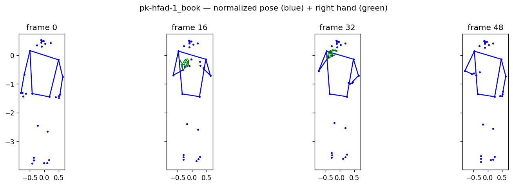

# AI Sign Language Translator — Pakistan Sign Language (PSL)

Real-time sign language translation: **Webcam → PSL → English / Urdu text**.

Webcam frames are converted by MediaPipe into the same 3D landmark format used in the
`pk-hfad-1` dataset, a sequence model (LSTM/Transformer) predicts the PSL sign, and the
predicted label is mapped to English and Urdu words using the dictionary mapping.

## Pipeline

**Phase 1 — train the recognition model (offline, from the pre-extracted landmark dataset):**

```
pk-hfad-1 landmark CSVs (788 sign videos)
        +
data/mappings/pk-dictionary-mapping.json
        ↓
preprocess (normalize, pad/trim sequences, encode labels)
        ↓
train sequence model
        ↓
[landmark sequence] → ML model → PSL sign → English / Urdu text
```

**Phase 2 — real-time webcam translation:**

```
Webcam
   ↓
OpenCV captures frames
   ↓
MediaPipe extracts pose + hand landmarks (same format as training data)
   ↓
trained sequence model
   ↓
predicted PSL sign
   ↓
dictionary mapping → English + Urdu text
```

## Project structure

```
AI-Sign-Language-Translator/
│
├── configs/
│   ├── bilstm.json                  # BiLSTM hyperparameters
│   └── transformer.json             # Transformer hyperparameters
│
├── data/
│   ├── landmarks/
│   │   └── pk-hfad-1.landmarks-mediapipe-world-csv/   # 788 landmark CSVs (~110 MB, gitignored)
│   ├── mappings/
│   │   └── pk-dictionary-mapping.json                 # label → English/Urdu word mapping
│   └── splits/
│       ├── train.csv, val.csv, test.csv               # split index files
│       ├── label_map.json                             # label → class ID + tokens
│       └── excluded.txt                               # labels excluded from all splits
│
├── models/         # saved checkpoints (.weights.h5, .config.json, .history.csv)
├── notebooks/      # exploration & visualization notebooks
│
├── src/
│   ├── data/
│   │   ├── dataset.py        # landmark parsing, normalization, augmentation, sequence loading
│   │   └── split.py          # train/val/test split generation
│   ├── model.py              # BiLSTM and Transformer architectures
│   ├── train.py              # training loop with early stopping and checkpointing
│   ├── evaluate.py           # test-set evaluation with confidence sweep
│   ├── sanity_check.py       # landmark CSV validation
│   ├── visualize_samples.py  # skeleton and trajectory plots
│   └── app.py                # real-time webcam recognition app (Phase 5)
│
├── requirements.txt
└── README.md
```

## Dataset

All data comes from
[sign-language-translator/sign-language-datasets](https://github.com/sign-language-translator/sign-language-datasets):
Pakistan Sign Language videos taught at the **Hamza Foundation Academy for the Deaf,
Lahore, Pakistan**, pre-extracted into MediaPipe landmark CSVs. The raw videos are **not**
needed — the dataset repository publishes the landmark archives separately.

### What is included here

| Path | Contents | Size | Source |
|---|---|---|---|
| `data/landmarks/pk-hfad-1.landmarks-mediapipe-world-csv/` | 788 CSV files, one per sign video | ~110 MB | [release v0.0.4](https://github.com/sign-language-translator/sign-language-datasets/releases/tag/v0.0.4) |
| `data/mappings/pk-dictionary-mapping.json` | sign label → word translations (en, ur, hi, ...) | ~161 KB | [`parallel_texts/`](https://github.com/sign-language-translator/sign-language-datasets/tree/main/parallel_texts) |

To reproduce the downloads (PowerShell):

```powershell
# 1) landmark dataset (23 MB zip → extracts to 788 CSVs)
Invoke-WebRequest "https://github.com/sign-language-translator/sign-language-datasets/releases/download/v0.0.4/pk-hfad-1.landmarks-mediapipe-world-csv.zip" -OutFile "data\landmarks\pk-hfad-1.landmarks-mediapipe-world-csv.zip"
Expand-Archive "data\landmarks\pk-hfad-1.landmarks-mediapipe-world-csv.zip" -DestinationPath "data\landmarks\pk-hfad-1.landmarks-mediapipe-world-csv"

# 2) dictionary mapping
Invoke-WebRequest "https://raw.githubusercontent.com/sign-language-translator/sign-language-datasets/main/parallel_texts/pk-dictionary-mapping.json" -OutFile "data\mappings\pk-dictionary-mapping.json"
```

### What is intentionally NOT downloaded

| File | Why not |
|---|---|
| `pk-hfad-1.landmarks-mediapipe-image-csv.zip` | Image-space coordinates (fractions of frame width/height) instead of world coordinates (meters). Don't mix coordinate systems — stick to `mediapipe-world`. |
| `pk-hfad-1.videos-mp4.zip` (release v0.0.3) | Raw videos. Landmarks are already extracted, so re-running MediaPipe over thousands of frames is unnecessary. Only needed later if you re-extract with a different model. |

### Landmark CSV format

Each CSV is one sign video; each row is one video frame; every file has exactly
**375 columns** = 75 landmarks × 5 values:

| Landmark group | Indices | Values per landmark |
|---|---|---|
| Pose (MediaPipe Pose) | 0–32 | `x, y, z, a, b` |
| Left hand (MediaPipe Hands) | 33–53 | `x, y, z, a, b` |
| Right hand (MediaPipe Hands) | 54–74 | `x, y, z, a, b` |

- `a` = visibility, `b` = presence (confidence scores)
- World coordinates are 3D joint positions in **meters**, rounded to 4 decimal places
- Missing pose/hands in a frame are zero-filled
- Header: `x0,y0,z0,a0,b0,x1,y1,z1,a1,b1,...,x74,y74,z74,a74,b74`
- Row count = number of frames in the source video

The **label** of a sample is its filename with the format suffix removed:

```
pk-hfad-1_1.landmarks-mediapipe-world.csv  →  label: pk-hfad-1_1
```

### Dictionary mapping format

`data/mappings/pk-dictionary-mapping.json` is a JSON array of two dictionaries — the
pk-hfad-1 standard dictionary (776 entries) and a small list of constructable
sign-phrases (18 entries):

```json
[
  {
    "country": "pk",
    "description": "pakistan sign language videos taught in hamza foundation academy for the deaf,lahore, pakistan.",
    "mapping": [
      {
        "label": "pk-hfad-1_1",
        "token": {
          "en": ["1", "one", "a(article)", "an"],
          "ur": ["1", "۱", "ایک", "اک", "اِک", "یکم"]
        }
      }
    ]
  }
]
```

Compound signs additionally list the component signs:

```json
{
  "components": ["pk-hfad-1_a(double-handed-letter)", "pk-hfad-1_market"],
  "label": "pk-hfad-1_advertisement",
  "token": {
    "en": ["advertisement", "advertising", "advertise"],
    "ur": ["اشتہار", "تشہیر"]
  }
}
```

### Verified dataset statistics

- 788 landmark CSVs in `pk-hfad-1`, all with exactly 375 columns
- 775 CSVs have a direct entry in the dictionary mapping (usable as labeled classes)
- 13 CSVs are compound sign-phrases (e.g. `pk-hfad-1_hm(we)-aaein`) with no individual
  dictionary entry — their meaning is still readable from the filename gloss
- The dictionary's 776 entries include one label (`pk-hfad-2_hour`) that belongs to the
  separate pk-hfad-2 dataset and has no CSV here
- Word tokens per official stats: en 1,591 / ur 2,081

## Setup

Python 3.9–3.12 is recommended (MediaPipe wheel availability).

```powershell
python -m venv .venv
.venv\Scripts\activate
pip install -r requirements.txt
```

## Usage

### Phase 0 — data exploration

```powershell
# Sanity-check the landmark CSVs
python src/sanity_check.py

# Visualize sample trajectories and skeleton plots
python src/visualize_samples.py
```

### Phase 1 — data preparation

```powershell
# Generate train/val/test splits and label_map.json
python src/data/split.py
```

### Phase 2 — model definition

```powershell
# Smoke-test the model architectures
python src/model.py --model bilstm
python src/model.py --model transformer
```

### Phase 3 — training

```powershell
# Quick smoke test (24 classes, 2 epochs)
python src/train.py --dry-run

# Full 775-class BiLSTM training
python src/train.py

# Transformer architecture with custom config
python src/train.py --config configs/transformer.json --epochs 80

# Train on a subset (e.g. 100 classes)
python src/train.py --classes-file models/vocab-100.txt --run-name bilstm-vocab100
```

### Phase 4 — evaluation

```powershell
# Evaluate the newest checkpoint on the test split
python src/evaluate.py

# Evaluate a specific run
python src/evaluate.py --run bilstm --split test
```

### Phase 5 — real-time webcam app

```powershell
# Run with default settings (newest checkpoint, both languages, TTS on)
python src/app.py

# Choose a specific checkpoint
python src/app.py --run bilstm

# Output language
python src/app.py --lang en       # English only
python src/app.py --lang ur       # Urdu only (TTS auto-disabled)
python src/app.py --lang both     # English + Urdu (default)

# Toggle speech and camera
python src/app.py --no-tts        # disable text-to-speech
python src/app.py --camera 1      # use second webcam

# Fine-tune inference
python src/app.py --threshold 0.7   # higher confidence gate (default 0.6)
python src/app.py --interval 5      # inference every N frames (default 8)
```

Press **q** or **ESC** in the webcam window to quit.

### Demo

<!-- TODO: Replace with an actual screen recording GIF -->

*A short GIF showing the live webcam overlay with landmark skeleton,
predicted English/Urdu text, and confidence score will be added here
once a trained checkpoint is available.*

## Known limitations

This project is **isolated-sign recognition**, not continuous sign language
translation. Understanding these boundaries helps set realistic expectations
for a live demo:

| Limitation | Detail |
|---|---|
| **Vocabulary size** | 775 distinct signs from the pk-hfad-1 dataset. Any sign outside this vocabulary will be misclassified into the closest known class. |
| **Lighting and camera sensitivity** | MediaPipe landmark detection degrades in low light, strong backlight, or cluttered backgrounds. A well-lit, plain background works best. |
| **One-hand vs two-hand signs** | Both are supported (MediaPipe Holistic tracks two hands), but signs that rely on subtle finger-shape differences between one-hand and two-hand variants may confuse the classifier. |
| **No sentence-level grammar** | The model predicts one isolated sign at a time from an 80-frame sliding window. It does not model sign-to-sign transitions, grammar, or syntax — signing a sequence of words will produce a sequence of independent predictions, not a coherent sentence. |
| **Person-generalization** | Training data comes from a single signer (Hamza Foundation Academy instructor). Accuracy on a different signer, body proportions, or signing speed will be noticeably lower than the test-set metrics. |
| **Latency** | Inference runs every 8 frames on a ~2M parameter model. On CPU-only machines there is a perceptible lag; a GPU or a smaller model improves this. |
| **Urdu text rendering** | OpenCV's `putText` does not support Arabic/Urdu script natively (no RTL, no ligatures). Urdu tokens are overlaid as-is and may render as boxes or reversed characters. A Pillow + font-based renderer would fix this. |
| **Confidence calibration** | Softmax probabilities are not perfectly calibrated — a 60% confidence threshold is a reasonable default but the optimal value depends on the specific checkpoint. |

## License & attribution

The dataset is licensed under
[CC BY 4.0](https://creativecommons.org/licenses/by/4.0/) — appropriate credit and
citation of the original creators are required:

- Dataset: [sign-language-translator/sign-language-datasets](https://github.com/sign-language-translator/sign-language-datasets)
- Videos: Hamza Foundation Academy for the Deaf, Lahore, Pakistan
